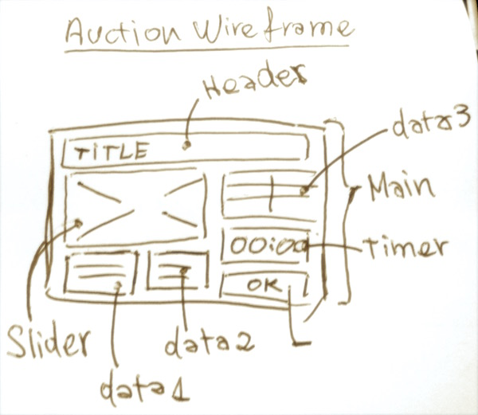
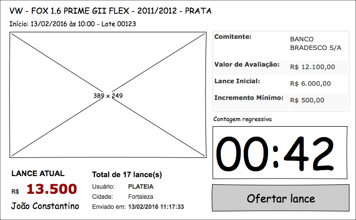
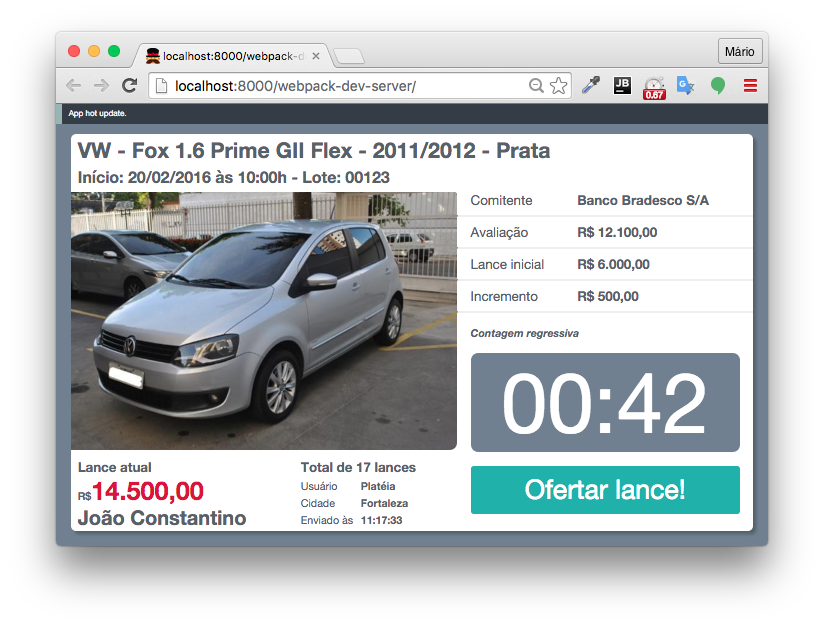

# Auction

A simple project to learn ReactJS

[](https://travis-ci.org/macndesign/auction)
[](https://codeclimate.com/github/macndesign/auction)
[](https://codeclimate.com/github/macndesign/auction)
[](https://coveralls.io/github/macndesign/auction?branch=master)

## How to develop

1. Clone this repository.
2. Create a virtualenv with Python 3.5
3. Activate a virtualenv.
4. Install dependencies.
5. Configure a instance with .env

```console
git clone git@github.com:macndesign/auction.git auction
cd auction
python -m venv .wttd
source .wttd/bin/activate
pip install -r requirements-dev.txt
cp contrib/env-sample .env
python manage.py test
```

## How to deploy

1. Create a instance on Heroku.
2. Send the configurations to the Heroku.
3. Define a secure SECRET_KEY to a instance.
4. Set DEBUG=FALSE
5. Configure a email service
6. Send the code to the Heroku.

```console
heroku create myinstance
heroku config:push
heroku config:set SECRET_KEY=`python contrib/secret_gen.py`
heroku config:set DEBUG=False
# configure a email
git push heroku master --force
```

## I'll beginning with a drawing



## Then a wireframe



## Finally into the browser



Use: https://github.com/newtriks/generator-react-webpack

```
Pah!!!
(\____/)
( ͡ ⚫͜ ʖ͡⚫
\╭☞ \╭☞
```
